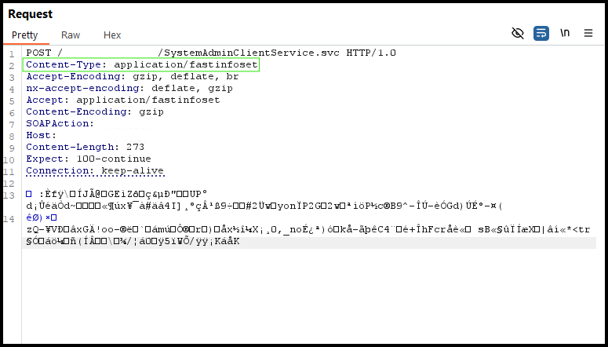

<h1 align="center">FastInfoset Helper</h1>

<div align="center">
    A burp extension to allow for easy decoding, manipulation, and encoding of Fast Infoset data.
</div>

## Background

Fast Infoset is an international standard that specifies a binary encoding format for the XML Information Set as an alternative to the XML document format. Due to it being binary, it's difficult to work with on-the-fly whilst testing an application which uses it.
This tool will decode the Fast Infoset binary data into a readable XML format, which can then be viewed, sent to Repeated, edited, and easily re-encoded into binary before being sent.

This tool comprises two elements:

1. A Python script, which is imported into Burp in the usual way
2. A .NET executable (currently an EXE file, but could be built any way you desire, e.g. a DLL) which is called by the Python script in Burp to decode and encode the Fast Infoset data

The .NET executable was chosen in this case as there's NuGet packages which can be used for Fast Infoset decoding. These weren't as easily available in Python, but a solution could perhaps be found by using a Java Fast Infoset package with Jython, having everything in one Python extension for burp - pull requests are welcome for such solutions.

## Limitations

Currently, the tool will only process uncompressed, or GZip compressed, Fast Infoset data. This has not been tested with other compression algorithms, such as DEFLATE, and is unlikely to work. Again, pull requests are welcomed here.

## Setup

1. Build the .NET executable, however way you wish. A Visual Studio solution file is provided for ease.
	- The LiquidTechnologies.FastInfoset NuGet package is a requirement for this project. It can be added to the project, if required, in Visual Studio by Tools -> NuGet Package Manager -> Manage NuGet Packages for Solution -> Browse for "LiquidTechnologies.FastInfoset" and install it.
2. Copy the resultant EXE wherever you wish. Take note of the location, and then update the Python file with its location:

```python
# Add your EXE path here
FASTINFOSETHELPER_EXE_PATH = "C:\\Path\\To\\The\\Helper.exe"
```

3. Add the Python extension to Burp in the usual way, ensuring you've got the Jython interpreter available and set up.

## Usage

If a request or response contains the header 'Content-Type: application/fastinfoset' then a tab will appear in the HTTP editor context of Burp.

In this tab, the XML data will be shown and can be edited. Any changes made in this tab will be re-encoded and the HTTP message updated.

The edited document must be parseable XML and comply to the specification, otherwise the encoder/decoder is likely to fail if it is unable to parse the XML.

## Screenshots

An original Fast Infoset request without the tool:



Using the decoder tab after enabling the tool:


